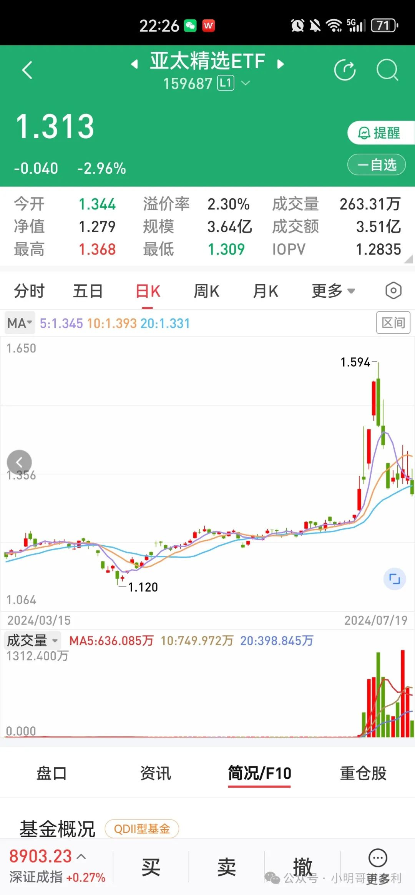
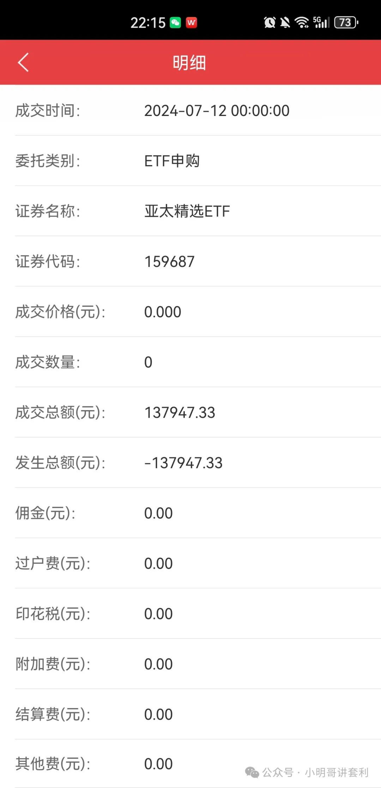
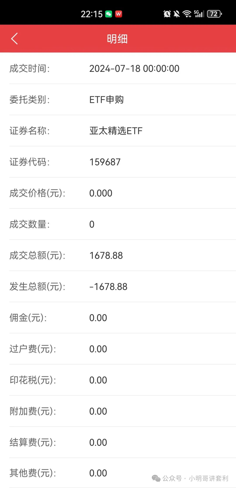
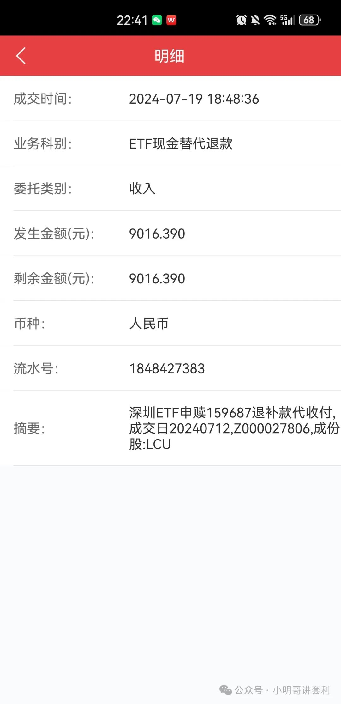
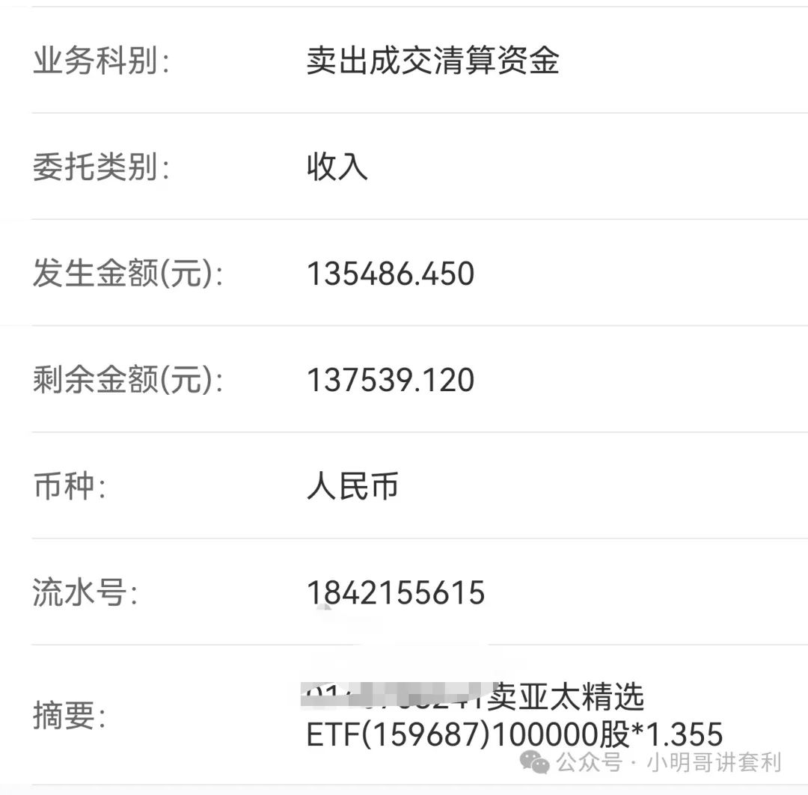

<!-- 2024-07-19 by 小明哥讲套利 -->

# 亚太精选（159687）套利实战解析，我是如何抢到的

下图是亚太精选的近期走势，从7月4日开始，亚太精选连续大涨，众多游资、牛散以及套利党参与其中。
 

7月4-10日，是连续上涨阶段，最高成交额达到了19亿，要知道亚太精选场内规模也就三个亿左右。这几天很多套利党都在申购，不出意外，你我都很难抢到。
 
7月10日触及高点后，开始连续三天下跌，这三天的下跌劝退不少套利党，但是根据亚太精选的溢价率，无论是相对净值还是相对IOPV，都有五个点以上的溢价。
 
所有份额还是很难抢，但是比前几天好多了，我有幸在7月12日，也就是上周五抢到了一个篮子。
 

对于当天的申购，有些朋友说我会亏钱，我坚信是不会的，正好今天退补款回来了，我计算了下，证实确实盈利的，不过盈利并没有超过5%，说明当时的溢价，并不一定是真实盈利，毕竟补券有成本，汇率也会有影响。
 
这也说明，我们在套利时候，最好预留一些溢价率空间，否则可能亏钱。
 
下面来计算下这次的盈利情况，也算是对跨境ETF套利的一个小介绍。
 
上面图写了上周五申购的时候，冻结的现金137947.33元。
昨天，也就是周四现金差额划出，1678.88元，划出时间为交易时间，这个也是自己的成本。
 

今天，也就是周五晚上，退补款回来了。
 

我的卖出价格是1.355元
 

下面可以计算我的盈利了：135486.45+9016.39-1678.88-137947.33=4876.33元。
 
也就是赚了4876.33元，盈利3.5%，当时的溢价率我记得是5%多点，可见是可以赚钱的。
 
我是怎么抢到的呢？
 
1.运气很重要。
 
2.挂单技巧也很重要，跨境ETF申购不支持隔夜委托，只能八点半至九点之间委托。不同的券商开放系统的时间不一样，大家记得咨询自己的客户经理，选择第一时间挂单。
 
3.每天记得挂单，坚持最为重要。
